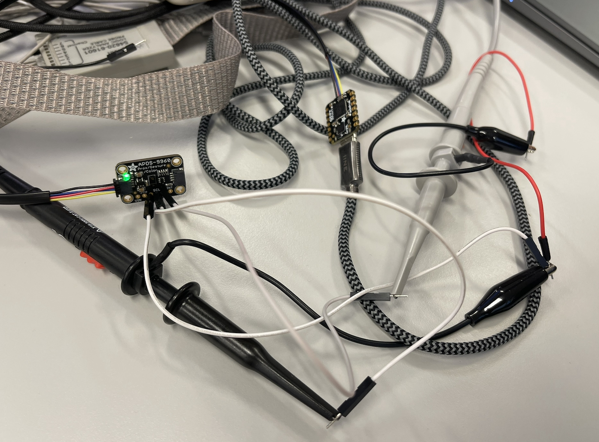

## Part5.  I2C_traffic

#### Task

- Use the firefly code to generate ADPS9960 I2C traffic and display it on a lab oscilloscope. 
- Take screenshots of some portion of this exchange, and figure out what's happening based on the protocol documentation in the ADPS9960 datasheet.

#### Connection

The connection between oscilloscope and APDS9960.

We use the first probe (X probe) to connect to the SDA with x10, the second probe(Y probe) to the CLK, and two associated black probes to the GND. 

#### What shows in the oscilloscope: 

